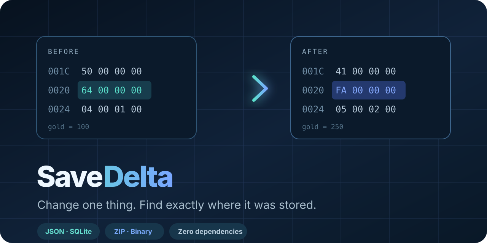

<p align="center">
  
</p>

<p align="center">
  <a href="https://github.com/KanadeK/savedelta/actions/workflows/ci.yml"></a>
  <a href="https://github.com/KanadeK/savedelta/releases/latest"></a>
  <a href="https://github.com/KanadeK/savedelta/blob/main/LICENSE"></a>
  
  
</p>

# SaveDelta

**Change one thing. Find exactly where an app stored it.**

SaveDelta captures application state before and after one deliberate change,
then explains the delta at the most useful level available:

- `$.player.gold: 100 → 250` inside JSON;
- `inventory[id=3]` added inside SQLite;
- `meta.json` changed inside a ZIP container;
- `0x24: 64 00 00 00 → FA 00 00 00` inside an unknown binary save.

It is built for game modders, QA engineers, migration testers, support teams,
and anyone reverse-engineering an undocumented local format. Inputs are never
modified, no file is uploaded, and the CLI has **zero runtime dependencies**.

## See it in 60 seconds

```bash
git clone https://github.com/KanadeK/savedelta.git
cd savedelta
python -m pip install -e .
savedelta demo savedelta-demo
```

Open `savedelta-demo/report.html`. The generated demo contains real JSON, INI,
SQLite, ZIP, and binary state changes plus a rename, addition, and deletion.

Prefer a single downloadable file? Get `savedelta.pyz` from the latest Release:

```bash
python savedelta.pyz demo savedelta-demo
```

## The real workflow

Capture a directory before changing one setting:

```bash
savedelta snapshot "/path/to/save-folder" -o before.sdelta
```

Change exactly one thing in the game or app, save, then capture again:

```bash
savedelta snapshot "/path/to/save-folder" -o after.sdelta
```

Compare the snapshots. If you know the visible value changed from 100 to 250,
tell SaveDelta; it will rank likely binary fields and exact structured paths:

```bash
savedelta diff before.sdelta after.sdelta \
  --expect 100:250 \
  --format html \
  --output report.html
```

You can also compare two live files or directories directly:

```bash
savedelta diff save-old.dat save-new.dat --expect 100:250
savedelta diff state-before/ state-after/ --format json > delta.json
```

## What it understands

| Input | Analysis |
|---|---|
| Files and directories | Added, removed, modified, unchanged, and content-identical rename detection |
| `.sdelta` snapshots | Portable ZIP-based capture with hashes, generated member names, and an inspectable manifest |
| JSON | Recursive JSONPath-like value changes and exact expected-value matches |
| TOML | Structural table, array, key, value, and type changes |
| INI / CFG | Section and case-preserving option changes |
| Text | Encoding detection, line statistics, and bounded unified diff |
| SQLite | Schema objects, tables, row counts, primary-key/rowid row changes |
| ZIP | Member add/remove/modify, metadata, and bounded deep analysis of changed members |
| Unknown binary | Changed ranges, size shift, entropy, ASCII previews, byte histograms, numeric field candidates |

Numeric field location supports signed and unsigned integers plus 32/64-bit
floats in little- and big-endian layouts. Each candidate includes an offset,
type, endianness, byte representation, and explainable confidence score.

## Why another diff tool?

Excellent tools already solve individual parts of this problem:
[ImHex](https://github.com/WerWolv/ImHex) is a full hex workbench,
[biodiff](https://github.com/8051Enthusiast/biodiff) aligns two binary files,
[Regshot](https://github.com/Seabreg/Regshot) compares Windows registry
snapshots, and SQLite ships
[`sqldiff`](https://sqlite.org/sqldiff.html) for database-to-database SQL.

SaveDelta targets the missing workflow between them:

| Capability | SaveDelta | Hex editors | Regshot | `sqldiff` |
|---|:---:|:---:|:---:|:---:|
| One portable before/after capture | ✅ | — | Windows only | — |
| Mixed directory formats | ✅ | — | Metadata-oriented | — |
| Structured JSON/TOML/INI paths | ✅ | — | — | — |
| SQLite row-level explanation | ✅ | — | — | ✅ |
| Unknown binary range map | ✅ | ✅ | — | — |
| “100 became 250” field locator | ✅ | Manual | — | — |
| Self-contained HTML + JSON report | ✅ | Varies | ✅ | SQL |
| Zero runtime dependencies | ✅ | — | Native app | Native binary |

The goal is not to replace a hex editor. It is to get you from “something
changed” to the smallest useful shortlist before opening one.

## Commands

### `snapshot`

```text
savedelta snapshot SOURCE -o OUTPUT.sdelta
  --ignore GLOB           repeatable custom exclusion
  --no-default-ignore     include lock/temp files
  --store                 disable compression
  --json                  machine-readable statistics
```

Default exclusions are `.git`, `.DS_Store`, `Thumbs.db`, lock files, and common
temporary-file suffixes. Symlinks are skipped and reported.

### `diff`

```text
savedelta diff BEFORE AFTER
  --format text|json|html
  --output PATH
  --expect FROM:TO        repeatable; decimal, hex, or float
  --max-file-bytes 64MiB
  --max-details 300
  --max-sqlite-rows 5000
  --no-renames
  --fail-on-change
```

`--fail-on-change` returns exit code `1` when differences exist, which makes
SaveDelta usable as a CI policy check. Expected failures and invalid input
return `2`.

### `inspect`

```bash
savedelta inspect save.dat
savedelta inspect world.db --format json
```

Shows format, size, SHA-256, entropy, text encoding, printable binary strings,
SQLite objects, or ZIP inventory without changing the input.

### `demo`

```bash
savedelta demo savedelta-demo
savedelta demo savedelta-demo --force --json
```

Generates fully synthetic data. No proprietary game files are bundled.

## Reports

- **Text** is compact and terminal-friendly.
- **JSON** follows the versioned schema in
  [`docs/report.schema.json`](docs/report.schema.json).
- **HTML** is a printable, responsive, self-contained file with byte heatmaps,
  structured tables, SQLite rows, and expected-value candidates.

The HTML renderer escapes every input-derived string, has no JavaScript or
network assets, and applies a restrictive Content Security Policy.

## Safety and limits

SaveDelta is read-only with respect to analyzed inputs. It copies SQLite bytes
to a temporary file and opens them in query-only mode; it inspects ZIP members
in memory without extraction; snapshots use generated archive member names so
original paths cannot become extraction paths.

Defaults intentionally bound expensive work:

- 64 MiB deep-analysis limit per changed file;
- 5,000 scanned rows per SQLite table;
- 20,000 ZIP entries and 512 MiB expanded metadata budget;
- 2 MiB and 20 members for nested ZIP analysis;
- 300 detailed items per changed file.

Increase limits only for files you trust. See
[`docs/SECURITY_MODEL.md`](docs/SECURITY_MODEL.md) for the complete threat model.

## Development and acceptance

```bash
python -m pip install -e .
python scripts/check.py
python -m unittest discover -s tests -v
python scripts/smoke_test.py
python scripts/build_zipapp.py
python dist/savedelta.pyz --version
python -m pip wheel . --no-deps -w dist/wheel
```

The acceptance path is deliberately independent of external services and
third-party Python packages.

If a check fails, use the exact repair flow in
[`docs/TROUBLESHOOTING.md`](docs/TROUBLESHOOTING.md): reproduce the smallest
failing command, preserve the input, add a regression test, fix the bounded
analyzer, and rerun the entire acceptance sequence.

## Project map

```text
src/savedelta/
  source.py       live files and portable snapshot loading
  snapshot.py     atomic .sdelta creation
  compare.py      file pairing, rename detection, analyzer dispatch
  structured.py   JSON/TOML/INI structural changes
  sqlitediff.py   read-only schema and row comparison
  zipdiff.py      bounded archive member analysis
  binary.py       byte ranges, entropy, numeric field location
  report.py       text, JSON, and self-contained HTML
  cli.py          snapshot, diff, inspect, and demo commands
```

Design details live in [`docs/ARCHITECTURE.md`](docs/ARCHITECTURE.md).

## Roadmap

- pluggable parsers for community-owned save formats;
- content-defined binary alignment for shifted blocks;
- optional Windows registry capture adapter;
- patch export with explicit verification and backups;
- report-to-ImHex bookmarks;
- signed snapshots and reproducible capture mode.

See [`docs/ROADMAP.md`](docs/ROADMAP.md) for scoped milestones.

## Contributing

Synthetic fixtures, parsers for open formats, Windows/macOS testing, and report
accessibility improvements are especially welcome. Read
[`CONTRIBUTING.md`](CONTRIBUTING.md) before opening a pull request.

## License

[MIT](LICENSE) © 2026 KanadeK
