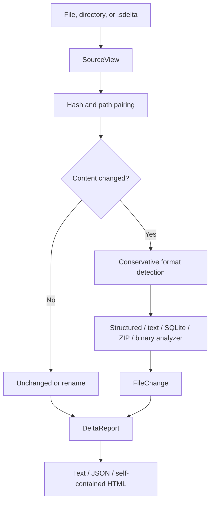

# Architecture

SaveDelta is a zero-runtime-dependency Python CLI. The architecture keeps input
acquisition, specialized analysis, and output rendering separate so malformed
content can fail locally without aborting a whole comparison.

## Data flow



## Core types

### `FileEntry`

A logical path, byte size, SHA-256 digest, optional native path, and bounded
reader. Directories and snapshots therefore expose the same interface without
extracting snapshot data.

### `SourceView`

A label plus a map of logical paths to `FileEntry` objects. A source can be a
single regular file, a directory tree, or a portable snapshot. Source warnings
are carried into the final report.

### `FileChange`

One added, removed, renamed, or modified logical file. Specialized analysis is
stored as a JSON-serializable `details` object with a `kind` discriminator.

### `DeltaReport`

The stable boundary between analysis and rendering. It contains source labels,
counts, expected-value matches, warnings, and ordered file changes.

## Snapshot format

`.sdelta` is a ZIP container:

```text
manifest.json
data/00000001.bin
data/00000002.bin
...
```

The manifest includes:

- `format_version`;
- creator version and UTC timestamp;
- whether the source was a single file;
- capture warnings;
- logical path, generated member name, size, and SHA-256 for every file.

Original paths never become ZIP member names. This removes path traversal from
the archive layout and lets a consumer validate logical paths independently.
Snapshot creation writes a temporary sibling and atomically replaces the
destination only after the ZIP is complete.

## Analyzer dispatch

Detection prefers magic bytes over extensions:

1. SQLite header;
2. ZIP signatures;
3. known structured/text extension;
4. parseable JSON;
5. safely decodable text;
6. binary fallback.

Every specialized analyzer is bounded. If parsing fails after both versions
were read, dispatch records a warning and falls back to binary analysis.

## Expected-value correlation

For structured formats, an expected value pair matches an exact changed path.
For binary data, SaveDelta packs the pair as:

- `u8`, `i8`;
- little- and big-endian `u16/i16`, `u32/i32`, `u64/i64`;
- little- and big-endian `f32/f64`.

It finds offsets where the before encoding becomes the after encoding at the
same position. Confidence is derived from uniqueness, typical width, alignment,
unchanged surrounding bytes, and stable file length. It is a shortlist, not a
claim that a proprietary field has been semantically proven.

## Extension points

A future analyzer should:

1. use a conservative detector;
2. accept bytes rather than mutate native input;
3. enforce work limits before parsing;
4. return JSON-safe details with a stable `kind`;
5. raise an expected analysis error on malformed input;
6. include adversarial and malformed-input tests;
7. add a dedicated HTML fragment only when the generic rendering is inadequate.
